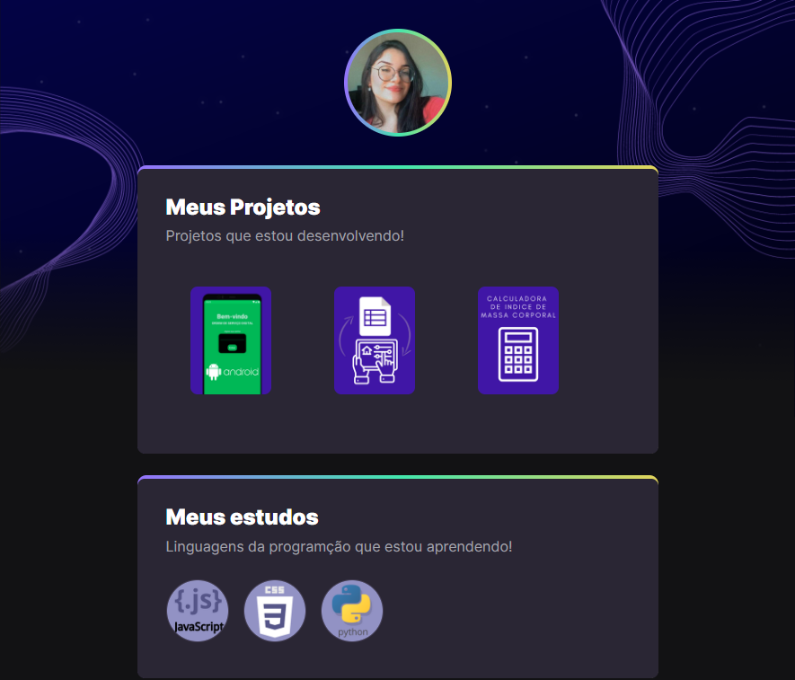

# NLW eSports - Trilha Explorer

    Trilha Explorer
O Projeto construido do evento Next Level Week da Rocketseat inicialmente tinha o objetivo de construir um perfil para jogadores com jogos favoritos e canais de streamers.
Está versão final após as aulas do evento foi elaborada para perfis de estudantes que estão iniciando na Área da tecnologia e programação compartilharem seus projetos desenvolvidos e novos conhecimentos.
## Tecnologias
- HTML
- CSS
- Git e Github
